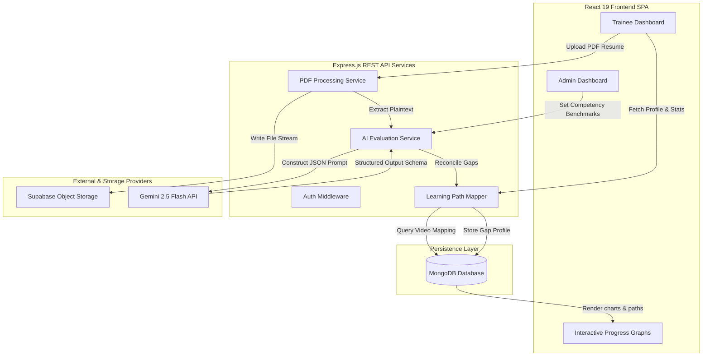

# 🧠 NeuralPath — Automated Skill Gap Analysis & Adaptive Upskilling Platform

[](https://react.dev/)
[](https://nodejs.org/)
[](https://www.mongodb.com/)
[](https://supabase.com/)
[](https://deepmind.google/technologies/gemini/)
[](LICENSE)

NeuralPath is an enterprise-ready B2B SaaS platform designed to automate trainee , competency auditing, and personalized technical upskilling. By leveraging AI-driven resume parsing, dynamic role benchmarking, and adaptive roadmap construction, the platform bridges the gap between hiring skills and team readiness.

---

## 🌟 Features

### Core Functionality
*   **AI-Driven Skill Gap Analysis**: Automatically parses PDF candidate resumes using **Gemini 2.5 Flash** to score individual technical skills on a scale of 0 to 10.
*   **Dynamic Role Benchmarking**: Admin capability to define role competency score targets and map educational resources to targeted technologies.
*   **Adaptive Learning Pathways**: Generates chronologically ordered upskilling roadmaps addressing identified technical gaps with curated video study resources.
*   **Cohort Dashboard**: Unified telemetry for engineering managers to inspect cohort preparedness, individual match percentages, and study velocity tracking graphs.
*   **Telemetry & Analytics**: Trainees log hours studied, tracking progress velocity via interactive **Recharts** area graphs.

### User Management
*   **JWT Authentication**: Secure authentication pipeline featuring token generation and `bcrypt` password hashing.
*   **Role-Based Access Control (RBAC)**: Secure separation between **Administrators** (who manage benchmarks, talent tracking, and assets) and **Trainees** (who upload resumes and complete study pathways).
*   **Route Protection Middleware**: Guards critical backend routes and conditionally renders client routes based on user authentication status and role.

### Technical Features
*   **Responsive UI/UX**: Visually optimized interfaces styled with **Tailwind CSS v4** and micro-interactions built using **Framer Motion**.
*   **Secure Object Storage**: Pipelines PDF resume files straight to a private/public **Supabase Storage** bucket using streaming Multer buffers.
*   **API Resilience & Fallbacks**: Features custom fetch wrappers with abort timers to handle Gemini API rate limits, with a localized offline regex-based parser backup.

---

## 🚀 Tech Stack

### Frontend
*   **React 19** - UI Framework
*   **Vite** - Dev server and bundler
*   **Tailwind CSS v4** - Styling framework
*   **Motion (Framer Motion)** - Page transitions and micro-animations
*   **Recharts** - Dynamic data visualization charts
*   **Lucide React** - Icon library

### Backend
*   **Node.js** - JavaScript runtime environment
*   **Express.js** - Server framework
*   **MongoDB & Mongoose ODM** - Data storage and schema modeling
*   **Multer & PDF-Parse** - Document upload stream handling and text parsing
*   **JWT & Bcrypt** - Safe credentials storage and token authorization
*   **Google Gemini API** - LLM evaluation and gap analysis integration
*   **Supabase Client** - Storage SDK integration

---

## 📐 System Architecture & Workflow

NeuralPath decouples client-side telemetry dashboards, core REST endpoints, persistent storage layers, and LLM evaluation APIs.



### 🔁 The Core Analysis Loop
1.  **Ingestion & Persistence**: A trainee uploads their PDF resume. Multer streams the binary directly to **Supabase Storage**, which yields a secure, public file url.
2.  **Plaintext Extraction**: The system extracts the raw text from the file using `pdf-parse`.
3.  **LLM Semantic Scoring**: The server creates a custom evaluation prompt containing the target role requirement. The **Gemini 2.5 Flash API** acts as an evaluator, returning a structured JSON payload grading the candidate's proficiency.
4.  **Upskilling Compilation**: The backend compares candidate scores against role benchmark targets. Identified gaps are reconciled against learning paths, mapping corresponding study resources stored in MongoDB.

---

## 📋 Prerequisites
*   Node.js (v18.0.0 or higher)
*   MongoDB Instance (Local Community Server or Atlas Cluster)
*   Google Gemini API Key
*   Supabase Account (configured with a Storage bucket)

---

## 🛠️ Installation

### 1. Clone the Repository
```bash
git clone https://github.com/Raj0-0dev/neuralpath.git
cd neuralpath
```

### 2. Backend Setup
1.  Navigate to the backend directory:
    ```bash
    cd backend
    ```
2.  Install dependencies:
    ```bash
    npm install
    ```
3.  Create a `.env` file in the `backend/` folder:
    ```env
    PORT=3000
    MONGODB_URI=mongodb+srv://<username>:<password>@cluster0.mongodb.net/neuralpath
    JWT_SECRET=your_jwt_secret_token_here
    SUPABASE_URL=https://your-project-id.supabase.co
    SUPABASE_KEY=your-supabase-api-key-here
    SUPABASE_BUCKET_NAME=resumes
    GEMINI_API_KEY=your-google-gemini-api-key-here
    GEMINI_MODEL=gemini-2.5-flash
    ```
4.  Seed the administrator account:
    ```bash
    ADMIN_EMAIL=admin@neuralpath.com ADMIN_PASSWORD=SecureAdminPass123 npm run seed:admin
    ```

### 3. Frontend Setup
1.  Navigate to the frontend directory:
    ```bash
    cd ../frontend
    ```
2.  Install dependencies:
    ```bash
    npm install
    ```

### 4. Run the Application
Development server mode:

*   **Terminal 1 (Backend)**:
    ```bash
    cd backend
    ```
    ```bash
    npm run dev
    ```
*   **Terminal 2 (Frontend)**:
    ```bash
    cd frontend
    ```
    ```bash
    npm run dev
    ```
The application will be available at `http://localhost:5173`.

---

## 📖 Usage Guide

### Getting Started (Trainees)
1.  Register a new account or log in as a **Trainee**.
2.  Go to the Upload page and select your target role (e.g. Full-Stack Developer).
3.  Drag and drop your PDF resume.
4.  Upon processing, review your skill matching percentages and learning pathways.

### Tracking Progress
1.  Under the learning pathway page, view the modules mapped to your skill gaps.
2.  Follow the video resource links provided for structured study.
3.  Click "Mark Complete" to resolve the skill gap and update your readiness score.
4.  Track study hours on your metrics dashboard to visualize learning velocity.

### Administrator Control
1.  Log in using your seeded admin credentials.
2.  Navigate to the Talent Overview tab to audit cohort readiness scores.
3.  Go to the Benchmarks manager to add new required skills or modify targets for target roles.
4.  Create new resource mappings to bind tutorial videos to specific technologies.

---

## 🏗️ Project Structure

```text
neuralpath/
├── backend/
│   ├── controllers/      # Express controllers (auth, admin, resumes, gaps)
│   ├── data/             # Seeding scripts (seedVideos.js, seedAdmin.js)
│   ├── middleware/       # JWT verification & Multer config
│   ├── models/           # Mongoose Schemas (User, Role, SkillVideo, Resume)
│   ├── routes/           # REST endpoints
│   ├── services/         # Integrations (aiService, supabaseService, pdfService)
│   ├── app.js            # Express config
│   └── server.js         # Entry point
│
└── frontend/
    ├── src/
    │   ├── components/   # Reusable layouts, buttons, and routing gates
    │   ├── context/      # Context API (Theme, Authentication)
    │   ├── pages/        # Dashboard, Login, Admin views
    │   ├── App.jsx       # Root router
    │   └── main.jsx      # Vite entry point
```

---

## 🔒 Security Features
*   **Password Hashing**: Salts and hashes user passwords using `bcrypt` before storing them in MongoDB.
*   **Protected Endpoints**: Secures sensitive endpoints using Express authorization middleware checking bearer JSON Web Tokens.
*   **Bucket Privacy Controls**: Implements restricted write and public read access on Supabase storage nodes.
*   **Timeout Safeguards**: Gemini and Supabase requests auto-terminate after 30 seconds to prevent thread starvation.

---

## 🤝 API Endpoints

### Authentication
| Method | Endpoint | Description | Auth Required |
| :--- | :--- | :--- | :--- |
| `POST` | `/auth/register` | Register user profile and credentials | No |
| `POST` | `/auth/login` | Authenticate user credentials and return JWT | No |
| `GET` | `/auth/me` | Retrieve active user profile data | Yes (JWT) |

### Resume & Assessment
| Method | Endpoint | Description | Auth Required |
| :--- | :--- | :--- | :--- |
| `POST` | `/resumes/upload` | Ingest PDF resume, parse text, and run analysis | Yes (Trainee) |
| `GET` | `/gap-analysis/my-profile` | Fetch match percentage and core competency gaps | Yes (Trainee) |
| `GET` | `/learning-path` | Retrieve custom learning modules and progress | Yes (Trainee) |
| `POST` | `/learning-path/complete` | Mark a learning pathway module as completed | Yes (Trainee) |

### Administration
| Method | Endpoint | Description | Auth Required |
| :--- | :--- | :--- | :--- |
| `GET` | `/admin/employees` | Retrieve lists of trainees and readiness metrics | Yes (Admin) |
| `POST` | `/admin/roles` | Create new target role benchmarking criteria | Yes (Admin) |
| `POST` | `/admin/resources` | Add learning video resources mapped to skills | Yes (Admin) |

---

## 👥 Contributors
*   **Harsh Rajput** ([Raj0-0dev](https://github.com/Raj0-0dev))
*   **Harshit Maurya** ([harshitmaury-wq](https://github.com/harshitmaury-wq))
*   **Himanshu Ranjan** ([HimanshTheCoder](https://github.com/HimanshTheCoder))

---

## 📄 License
This project is licensed under the MIT License - see the [LICENSE](LICENSE) file for details.

---

## 🐛 Known Issues & Limitations
*   Resume parsing is optimized for single-column technical formatting.
*   Gemini API performance is bound by network latency and model availability.
*   Learning pathways map single videos per skill gap rather than comprehensive playlists.

---

## 🔮 Future Enhancements
*   Adding voice-guided skill assessments using conversational LLMs.
*   Integrating auto-generated progress certifications.
*   Expanding resource mappings to include textbooks and documentation links.

---

## 🖼️ Project Preview

### 🏠 Trainee Dashboard & Skill Matching


### 📊 Adaptive Upskilling Learning Pathway


### 🏢 Administrator Talent Overview & Role Benchmarks


---

Built with ❤️ by Harsh Rajput, Harshit Maurya & Himanshu Ranjan
