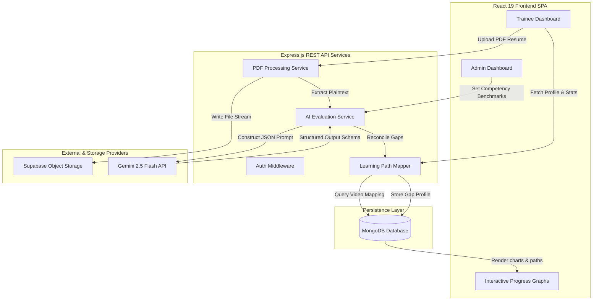
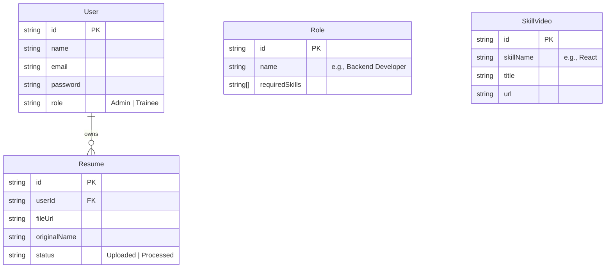

# 🧠 NeuralPath — Automated Skill Gap Analysis & Adaptive Upskilling Platform

[](https://react.dev/)
[](https://nodejs.org/)
[](https://www.mongodb.com/)
[](https://supabase.com/)
[](https://deepmind.google/technologies/gemini/)
[](LICENSE)

NeuralPath is an enterprise-ready B2B SaaS platform designed to automate trainee onboarding, competency auditing, and personalized technical upskilling. By leveraging AI-driven resume parsing, dynamic role benchmarking, and adaptive roadmap construction, the platform bridges the gap between hiring skills and team readiness.

---

## 📐 System Architecture & Workflow

NeuralPath follows a decoupling pattern between client-side dashboards, core REST services, storage layers, and third-party LLM evaluation models.



### 🔁 Analysis & Generation Loop
1. **Resume Upload**: Candidate uploads a PDF resume. The system uses a Multer stream to pipe the binary to **Supabase Object Storage**, obtaining a secure CDN URL.
2. **Text Processing**: `pdf-parse` extracts raw candidate text, filtering out formatting artifacts.
3. **LLM Evaluation**: The backend builds a detailed evaluation prompt, injecting the target role specifications. **Gemini 2.5 Flash** performs semantic analysis, scoring candidate competencies on a 0-10 scale.
4. **Gap Reconciliation**: The AI service maps current scores against the role benchmark, identifying deficiency thresholds.
5. **Path Construction**: The backend links each missing skill to curated video modules in **MongoDB** and generates a step-by-step, interactive learning path.

---

## ✨ Features

### 👤 Trainee Features
*   **Resume Ingestion**: Instant drag-and-drop resume upload with text parsing and processing progress indicator.
*   **AI Match Profile**: Immediate visualization of match percentage, list of matching competencies, and extracted skills.
*   **Adaptive Pathway**: Chronological study roadmap populated with pre-curated video segments, titles, and links matching the candidate's exact gaps.
*   **Study Velocity Tracking**: Log hours studied and mark items as complete, visualizing progress via dynamic, interactive **Recharts** area graphs.

### 🏢 Admin & Lead Features
*   **Talent Cohort Dashboard**: Aggregated overview of all trainees, including readiness scores, average match percentages, and uploaded resumes.
*   **Dynamic Role Builder**: Define required skill sheets, priority thresholds, and expected performance scores for specific development roles.
*   **Resource Center**: Maintain and map learning videos directly to technical skills (e.g., matching React Router videos to the "React" technical competency).

---

## 🛠️ Technology Stack

| Layer | Technologies Used | Rationale |
| :--- | :--- | :--- |
| **Frontend** | React 19, Vite, Tailwind CSS v4, Motion, Recharts | Fast rendering, decoupled state, hardware-accelerated animations, and responsive dashboard layouts. |
| **Backend** | Node.js, Express.js, Multer, PDF-Parse | Event-driven event loop, streaming file buffers, and clean middleware pipeline routing. |
| **Database** | MongoDB, Mongoose ODM | Document-based schema design allowing flexible nested structures for user logs and dynamic pathways. |
| **Services** | Supabase Storage, Google Gemini API | Cloud-native asset storage with custom CDN and structured LLM JSON extraction capabilities. |

---

## 📡 API Directory (HTTP REST Contract)

All API endpoints are prefixed with `/api`. Auth-guarded endpoints expect a bearer token: `Authorization: Bearer <JWT_TOKEN>`.

### 🔐 Authentication Module
| Method | Endpoint | Payload / Params | Response | Auth Required |
| :--- | :--- | :--- | :--- | :--- |
| `POST` | `/auth/register` | `{ name, email, password, role }` | `{ token, user }` | No |
| `POST` | `/auth/login` | `{ email, password }` | `{ token, user }` | No |
| `GET` | `/auth/me` | None | `{ user }` | Yes (JWT) |

### 📋 Resume & Assessment Module
| Method | Endpoint | Payload / Params | Response | Auth Required |
| :--- | :--- | :--- | :--- | :--- |
| `POST` | `/resumes/upload` | Form-data: `file` (PDF), `roleId` | `{ resume, gapAnalysis }` | Yes (Trainee) |
| `GET` | `/gap-analysis/my-profile` | None | `{ matchPercentage, gaps: [] }` | Yes (Trainee) |
| `GET` | `/learning-path` | None | `{ modules: [] }` | Yes (Trainee) |
| `POST` | `/learning-path/complete` | `{ moduleId }` | `{ updatedModule, isCompleted }` | Yes (Trainee) |

### 🏢 Administration Module
| Method | Endpoint | Payload / Params | Response | Auth Required |
| :--- | :--- | :--- | :--- | :--- |
| `GET` | `/admin/employees` | None | `[{ id, name, readinessScore }]` | Yes (Admin) |
| `POST` | `/admin/roles` | `{ name, requiredSkills: [] }` | `{ role }` | Yes (Admin) |
| `POST` | `/admin/resources` | `{ skillName, title, url }` | `{ resource }` | Yes (Admin) |

---

## 🗄️ Database Schemas (Mongoose Models)



---

## ⚙️ Development Environment Setup

### 1. Prerequisites
Ensure you have the following installed locally:
- [Node.js](https://nodejs.org/) (v18.0.0 or higher)
- [MongoDB Server](https://www.mongodb.com/try/download/community) or a MongoDB Atlas account
- A [Supabase](https://supabase.com) account with a storage bucket created (public/private read enabled)
- A [Google Gemini API Key](https://ai.google.dev/)

### 2. File Directory Configuration
Create a `.env` file in the root of the `/backend` directory:
```env
PORT=3000
MONGODB_URI=mongodb+srv://<username>:<password>@cluster0.mongodb.net/neuralpath
JWT_SECRET=your_jwt_secret_token_here
SUPABASE_URL=https://your-project-id.supabase.co
SUPABASE_KEY=your-supabase-api-key-here
SUPABASE_BUCKET_NAME=resumes
GEMINI_API_KEY=your-google-gemini-api-key-here
GEMINI_MODEL=gemini-2.5-flash
```

### 3. Installation & Database Seeding
Navigate to the directory and run commands:

```bash
# Clone the repository
git clone https://github.com/Raj0-0dev/neuralpath.git
cd neuralpath

# Install backend packages & seed the Administrator Account
cd backend
npm install
ADMIN_EMAIL=admin@neuralpath.com ADMIN_PASSWORD=SecureAdminPass123 npm run seed:admin

# Install frontend packages
cd ../frontend
npm install
```

### 4. Running Dev Servers
Start the backend first:
```bash
# inside /backend
npm run dev
```

Start the frontend:
```bash
# inside /frontend
npm run dev
```
Open your browser and navigate to `http://localhost:5173`.

---

## 🛡️ Exception Handling & Fallbacks
To guarantee high availability and prevent downtime when calling external web APIs, NeuralPath implements the following protocols:
- **API Request Timeouts**: Integrations with Gemini and Supabase use a custom fetch wrapper featuring abort signals, terminating hangs after `30,000ms`.
- **Offline Regex Extractors**: In case of Gemini API rate-limiting or outages, a regex parser analyzes the resume buffer against standard developer dictionaries to construct a baseline profile.
- **Fail-safe Roles**: If a generated role fails validation, standard template fallback mappings (Frontend, Backend, DevOps, Data Science) are used automatically.

---

## 👥 Contributors
*   **Harsh Rajput** ([Raj0-0dev](https://github.com/Raj0-0dev))
*   **Harshit Maurya**
*   **Himanshu Ranjan**

---

## 📄 License
This project is licensed under the MIT License - see the [LICENSE](LICENSE) file for details.
