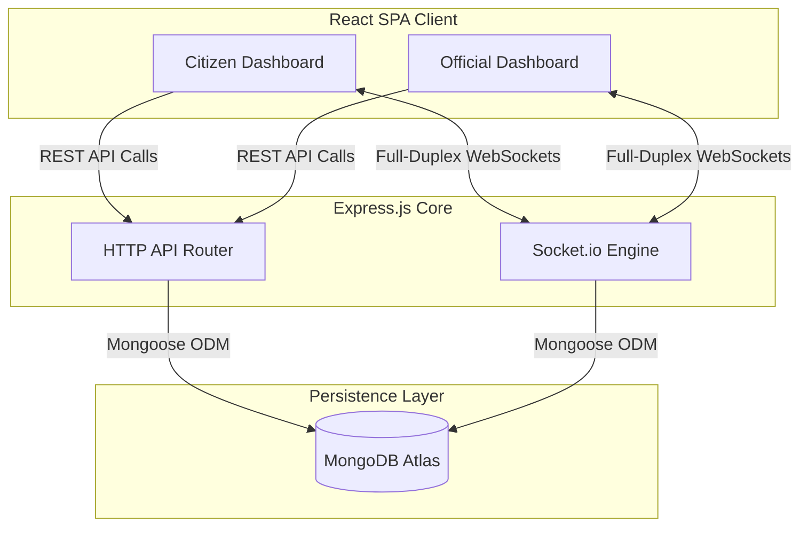

# 🏢 CityVoice — Real-Time Civic Portal

CityVoice is a production-ready, real-time citizen-to-municipality reporting and tracking platform. Residents can report municipal issues (e.g., sanitation, street lighting, water leakage) and coordinate directly with verified city departments to track resolution progress step-by-step.

---

## 🛠️ Architecture & System Design



---

## ✨ Features

### 👤 Citizen Features
* **Interactive Reporting**: Upload issues under specific categories (Water, Roads, Sanitation, etc.) with detailed descriptions and pictures.
* **Community Feed**: View, upvote, and discuss neighborhood reports submitted by fellow citizens.
* **Real-Time Timelines**: Follow issue updates (Reported ➡️ Assigned ➡️ In Progress ➡️ Resolved) as they are logged by officials.
* **Live Comments & Discussion**: Participate in room-based chat feeds with assigned technicians on active tickets.
* **Bulletins & Broadcasts**: Receive instant notifications for system-wide notices or local maintenance announcements.

### 🏢 Municipal Official Features
* **Department Filtering**: Officials only see issues belonging to their assigned departments.
* **Status Log Management**: Claim unclaimed tickets, update ticket statuses (e.g., Under Review, In Progress), and log customized action reports.
* **Transparency Uploads**: Upload photo evidence showing resolved maintenance repairs.

---

## 📖 Usage Guide

### Creating and Reporting Issues
1. Log in or create an account as a **Citizen**.
2. Click the **Report Issue** button in the dashboard portal.
3. Fill out the report form: select the category (Water Supply, Sanitation, etc.), describe the complaint details, and upload an optional image.
4. Submit the report to publish it to the community feed.

### Tracking and Upvoting
1. Go to the **Community Feed** tab.
2. View other neighborhood issues, search or filter by department/status, and upvote unresolved complaints to signal higher priority.
3. Click on a ticket to inspect its detail timeline milestones and write comment messages.

### Municipal Official Actions
1. Log in using your registered **Official** credentials.
2. Under the main dashboard list, click **Claim** to assign an unclaimed department ticket to yourself.
3. Click the assigned ticket, choose a new progress status (e.g., In Progress, Under Review), and write log details detailing the work.
4. Click **Resolve** when finished to write closing comments and upload photo evidence.

---

## 🛰️ API Directory (HTTP REST Contract)

### 🔐 Authentication Module
| Method | Endpoint | Description | Auth Required |
| :--- | :--- | :--- | :--- |
| `POST` | `/api/auth/register` | Register a new Citizen or Official user | No |
| `POST` | `/api/auth/login` | Authenticate credentials and return JWT | No |
| `GET` | `/api/auth/me` | Fetch active user credentials payload | Yes (JWT) |

### 📋 Issues Module
| Method | Endpoint | Description | Auth Required |
| :--- | :--- | :--- | :--- |
| `POST` | `/api/issues` | Create and report a new civic issue | Yes |
| `GET` | `/api/issues` | Retrieve all issues (supports department, priority filters) | Yes |
| `GET` | `/api/issues/:id` | Fetch detailed issue profile including timeline logs | Yes |
| `PUT` | `/api/issues/:id` | Update issue parameters (location, details) | Yes |
| `PUT` | `/api/issues/:id/claim` | Assign issue to department official | Yes (Official/Admin) |
| `PUT` | `/api/issues/:id/status` | Log status transition and write detail update | Yes (Official/Admin) |
| `PUT` | `/api/issues/:id/resolve` | Mark issue as resolved and upload closing notes | Yes (Official/Admin) |

### 💬 Comments Module
| Method | Endpoint | Description | Auth Required |
| :--- | :--- | :--- | :--- |
| `POST` | `/api/comments` | Post a new comment or reply to an issue thread | Yes |
| `GET` | `/api/comments/issue/:issueId` | Fetch nested tree of comments for a specific issue | Yes |

### 📢 Bulletins Module
| Method | Endpoint | Description | Auth Required |
| :--- | :--- | :--- | :--- |
| `POST` | `/api/bulletins` | Broadcast a new bulletin alert to all citizens | Yes (Admin/Official) |
| `GET` | `/api/bulletins` | Retrieve bulletins list | Yes |

### 🏢 Departments Module
| Method | Endpoint | Description | Auth Required |
| :--- | :--- | :--- | :--- |
| `GET` | `/api/departments/public-stats` | Public aggregated statistics of resolved/active issues | No |


---

## 🔒 Security Features

* **JWT-Based Authorization**: Restricts access to private APIs using JSON Web Token authentication middleware.
* **Secure Hashing**: Hashes user passwords using high-entropy `bcrypt` salts.
* **Role-Based Access Control (RBAC)**: Separates and verifies endpoint permissions for Citizens, Officials, and Admins.
* **CORS Policies**: Explicitly restricts API traffic to registered origins, blocking cross-origin exploits.
* **Sanitized Query Executions**: Prevents injection attacks using Mongoose ODM schema validation and strict parameter parsing.

---

## ⚙️ Configuration & Environment Variables

Create a `.env` file in the `backend/` directory with these parameters:

| Variable | Description | Default Value | Production Example |
| :--- | :--- | :--- | :--- |
| `PORT` | Local server port binding | `3000` | `10000` |
| `MONGODB_URI` | MongoDB Connection URI string | `mongodb://localhost:27017/cityvoice` | `mongodb+srv://...` |
| `JWT_SECRET` | Secret key used for signing web tokens | `your_secret_key` | `3829fba98...` |

---

## 🚀 Local Quickstart

### 1. Prerequisites
Make sure you have [Node.js](https://nodejs.org/) and [MongoDB](https://www.mongodb.com/) installed and running locally.

### 2. Backend Setup
1. Open a terminal and navigate to the backend folder:
   ```bash
   cd backend
   ```
2. Install dependencies:
   ```bash
   npm install
   ```
3. Run the development server (auto-seeds categories, departments, and test users if MongoDB collections are empty):
   ```bash
   npm run dev
   ```

### 3. Frontend Setup
1. Open a new terminal and navigate to the frontend folder:
   ```bash
   cd ../frontend
   ```
2. Install dependencies:
   ```bash
   npm install
   ```
3. Start the Vite React development server:
   ```bash
   npm run dev
   ```
4. Open your browser and navigate to `http://localhost:5173`.

---

## 📸 Screenshots

*Place your screenshots in a `docs/screenshots/` folder to display them in this layout:*

### 🏠 Landing Page & Connected Departments


### 👤 Citizen Dashboard & Community Feed


### 🏢 Municipal Department Portal


---

## 👥 Team
* **Harsh Rajput** — Lead Full Stack Developer ([Raj0-0dev](https://github.com/Raj0-0dev))

---

## 📄 License
This project is licensed under the MIT License. See the [LICENSE](LICENSE) file for details.

---

## 🐛 Known Issues & Limitations
* File uploads are restricted to `.png`, `.jpg`, and `.jpeg` image formats under 5MB.
* Real-time notifications and feed synchronization require active network sockets.

---

## 🔮 Future Enhancements
* **AI Auto-Categorization & Routing**: Integrated LLM parsing to analyze issue descriptions and auto-route them to the correct department.
* **In-App Live Chat**: Real-time direct messaging between reporters and assigned engineers.
* **Interactive Heatmaps**: Response time and issue density visualization maps for department leads.
